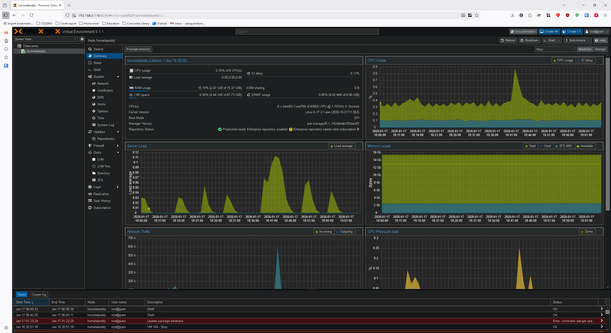

# Proxmox-VE

  

For the installation and configuration, it was quite simple for me because I have already done it in July 2025. Why did I go with Proxmox VE? Because after some reasearch and asking ChatGPT for Homelab setup, I was more attracted towards Proxmox because of its popularity, features and community support. For every questions you have, there's answer that you can find. However, I'm not saying there's no support for other open-softwares, but for learning purposes, hardware I had and what I wanted to accomplish at that time, Proxmox was a good choice.

## Table of contents
- Hardware
- Preparation
- Installation/Configuration

## Hardware
The computer used: *Lenovo ThinkPad T480*
- CPU: i5 8350u
- RAM: 16Gb DDR4-2400
- Storage: 256 Gb SSD
  - Additional storage
     - Western Digital Black SN770 2TB in an external enclosure -> To use with my Nextcloud configuration

## Preparation
There's nothing complicated in this part. Since you have to install a new OS in the computer, you have to make sure to keep all the files in a USB stick since everything will be deleted. In my case, I only had Kali Linux installed with no files or stuff that I wanted to keep. 

Next, you have to download the ISO of the open-software server management that you want. I went with [Proxmox VE](https://www.proxmox.com/en/downloads) because like I said before, I already knew what to do and how to install it. 

Now for the ISO, after you downloaded it, you have to create USB installation media with the bootable ISO so you can boot it in your computer and process with the installation. 
> [!TIP]
> There is tons of software and tools that you can find online to make your USB stick bootable. In my case, I went with [Rufus](https://rufus.ie/en/). Easy to install and use. Finally, make sure to change your boot option in your BIOS to the USB.

## Installation/Configuration

Now that I had my USB bootable ready with ISO in it, it was time to plug it in my computer. 

> [!WARNING]
> I remember making one mistake when I first used Proxmox. I installed everything using a Wifi card. That's not a big problem, but it has several technical limitations such has latency spikes and reduced bandwith. There also might be some future problems. However, you still can do it with a Wifi card, but there's more configuration to be done and I wasn't experienced enough for it. Here is a link for installation if you wish to use a [Wifi card](https://pve.proxmox.com/wiki/WLAN). In my case, I just reinstalled Proxmox using an Ethernet connection, because I didn't want to be bothered with additional configurations and was aiming for a simple process.

During the installation process, you will have multiple installation options such as Graphical installation, Terminal UI and others. I won't get into details about all of them, but the one I used was the Graphical Installation.

> [!TIP]
> During the process, make sure to write down your login information and IP address of your server. You will need them to get into the graphical user interface (GUI). 

After everything is installed, you will be directed into the terminal and it will tell you to use your web browser to configure your server. So I really wish you were not installing Proxmox in your main computer.

> [!TIP]
> Here's a link to one of the best community scripts out there for Proxmox, the [Proxmox VE-Helper Scripts](https://community-scripts.github.io/ProxmoxVE/). It will help you save so much time in installing anything you wish for your Homelab. Pretty much copy and paste into your Proxmox Terminal. However, make sure to read the documentations and try to understand what the code does before pasting it and installing. 

<h2 align="center">My Proxmox Server</h2>

<h2 align="center"> Well, that's it for the installation and configuration of my Proxmox Server. I invite y'all to look at my other repositories for the projects that I worked on. Thank you!</h2>

> [!TIP]
> Here's a link to the official Wiki page of [Proxmox VE](https://pve.proxmox.com/wiki/Main_Page)

I still wish to give you a link to a video that gives the step by step installation. I do believe it is complete and very resourceful. But you can actually find tons of them online that gives different approaches and also new configurations depending on what you wish to use it for. 

